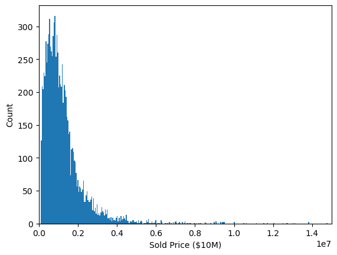
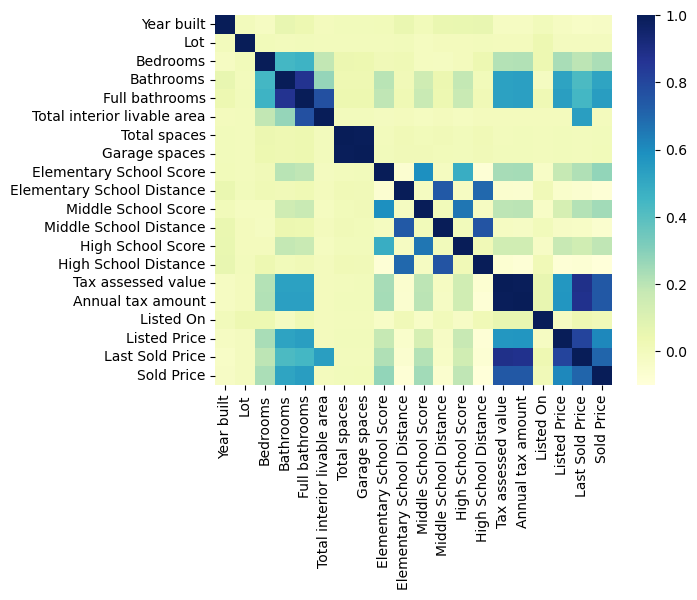
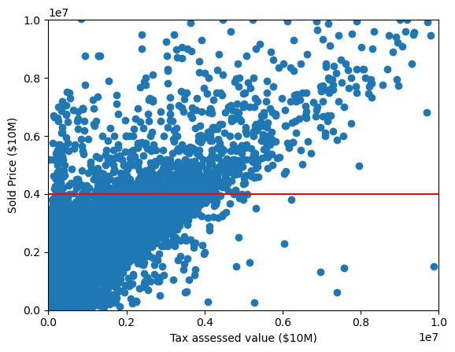
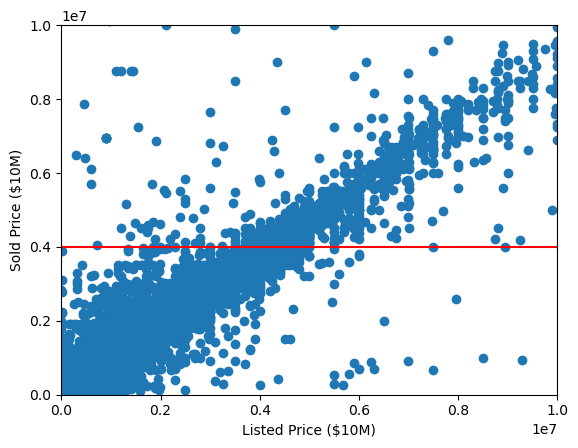

# California House Market Price Prediction

Author: Cayke Felipe dos Anjos


# Reproducibility

If you want to reproduce the results with this code, we make the requirements.txt file available in this repository. Running "pip install -r requirements.txt" on the terminal will install all packages with their used versions from the environment used here.

# Summary

In this project we analyze data from the California House Market competition from Kaggle (https://www.kaggle.com/c/california-house-prices/overview). 

For this problem, we are given a dataset with data containing a house's specifications (number of bedrooms, bathrooms, lot size, appliances, address...) and we build different regression models that predict its market price. If you are looking to buy a house, having a software that can show if a price is too high (bad deal) or too low (great deal) can save you some money or help you negotiate its value. If you are willing to sell your house, tho, knowing its price can help filter bad offers out.

The dataset is very disorganized at first. Several columns are actually redundant (like "Cooling" and "Cooling Features"), others are not filtered (number of bedrooms has several string entries) and a lot of missing data. The datasets are already divided into training and test set already, where the training set is used to fit models and tune their hyperparameters and the test set does not contain a target value. This is because, the test set must be submitted to the Kaggle Compeitition and the score is generated after. 

The main metric for this problem is the log RMSE: the Root Mean Squared Error between the log of the predicted value and the log of the true value. This is an important metric because of the different orders of magnitude we are dealing with. In this metric the error between predicting that a $\$100,000$ house actually costs $\$1,000,000$ is the same as predicting that a $\$1,000,000$ house costs $\$10,000,000$ which is one order of magnitude. However, because several models unfortunately still predict a negative price, we mainly use the normal RMSE to tune hyperparameters and choose our models. We still try to calculate log RMSE when possible and use it to choose our best model.

We first conduct an exploratory data analysis, clean the data and drop features that are redundant or not needed. We then build a pipeline that imputes missing data, one hot encodes left categorical data and standardized numerica data. Each model we test is coupled to this pipeline so we are able to have a pipeline ready for deployment in the end.

The best model is the XGBoost, with an log RMSE of 0.32, being closely followed by Random Forest (0.33) and GradientBoosting (0.35). We propose future steps and conclude our work.

# Business Problem

Buying a house is an important transition in a person's live. Besides being an important change between paying rent to live to own one yourself, houses can also be used an investiments or colaterals for banks. No matter if you are looking for a house to grow roots or to invest or if you are looking to sell your property, knowing its approximate market price can turn deals that seem good into bad or great ones.

Our client is a real state company. Being a real state company, they are always looking for the best deals for their clients who are trying to buy a house, meaning good houses being sold for less than what they should, or for a higher price for those are willing to sell. The real state market in the US is worth over 50 trillion dollars. It is one of the most important industries as everybody needs housing and their prices only go up with time.

This project aims to analyze data from the California House Market in order to be able to accurately predict the price of a house based on its features. Besides trying to answer which model is the best and how well does the algorithm do when compared to others we also try to answer:

* What are features that increase the house price?
* What are the cheapest and most expensive regions on average?
* What are the most important features used to predict the price?

# Exploratory Data Analysis and Data Cleaning

General form of the dataset:


<table border="1" class="dataframe">
  <thead>
    <tr style="text-align: right;">
      <th></th>
      <th>Id</th>
      <th>Address</th>
      <th>Sold Price</th>
      <th>Summary</th>
      <th>Type</th>
      <th>Year built</th>
      <th>Heating</th>
      <th>Cooling</th>
      <th>Parking</th>
      <th>Lot</th>
      <th>Bedrooms</th>
      <th>Bathrooms</th>
      <th>Full bathrooms</th>
      <th>Total interior livable area</th>
      <th>Total spaces</th>
      <th>Garage spaces</th>
      <th>Region</th>
      <th>Elementary School</th>
      <th>Elementary School Score</th>
      <th>Elementary School Distance</th>
      <th>Middle School</th>
      <th>Middle School Score</th>
      <th>Middle School Distance</th>
      <th>High School</th>
      <th>High School Score</th>
      <th>High School Distance</th>
      <th>Flooring</th>
      <th>Heating features</th>
      <th>Cooling features</th>
      <th>Appliances</th>
      <th>Laundry</th>
      <th>Parking features</th>
      <th>Tax assessed value</th>
      <th>Annual tax amount</th>
      <th>Listed On</th>
      <th>Listed Price</th>
      <th>Last Sold On</th>
      <th>Last Sold Price</th>
      <th>City</th>
      <th>Zip</th>
      <th>State</th>
    </tr>
  </thead>
  <tbody>
    <tr>
      <th>0</th>
      <td>0</td>
      <td>540 Pine Ln</td>
      <td>3825000.0</td>
      <td>540 Pine Ln, Los Altos, CA 94022 is a single f...</td>
      <td>SingleFamily</td>
      <td>1969.0</td>
      <td>Heating - 2+ Zones, Central Forced Air - Gas</td>
      <td>Multi-Zone, Central AC, Whole House / Attic Fan</td>
      <td>Garage, Garage - Attached, Covered</td>
      <td>1.0</td>
      <td>Ground Floor Bedroom, Master Bedroom on Ground...</td>
      <td>0.0</td>
      <td>NaN</td>
      <td>1.0</td>
      <td>0.0</td>
      <td>0.0</td>
      <td>Los Altos</td>
      <td>Santa Rita Elementary School</td>
      <td>7.0</td>
      <td>0.4</td>
      <td>NaN</td>
      <td>NaN</td>
      <td>NaN</td>
      <td>Los Altos High School</td>
      <td>8.0</td>
      <td>1.3</td>
      <td>Tile, Hardwood, Carpet</td>
      <td>Forced air, Gas</td>
      <td>Central</td>
      <td>Dishwasher, Dryer, Garbage disposal, Microwave...</td>
      <td>Washer / Dryer, Inside, In Utility Room</td>
      <td>Garage, Garage - Attached, Covered</td>
      <td>886486.0</td>
      <td>12580.0</td>
      <td>2019-10-24</td>
      <td>4198000.0</td>
      <td>NaN</td>
      <td>NaN</td>
      <td>Los Altos</td>
      <td>94022</td>
      <td>CA</td>
    </tr>
    <tr>
      <th>1</th>
      <td>1</td>
      <td>1727 W 67th St</td>
      <td>505000.0</td>
      <td>HURRY, HURRY.......Great house 3 bed and 2 bat...</td>
      <td>SingleFamily</td>
      <td>1926.0</td>
      <td>Combination</td>
      <td>Wall/Window Unit(s), Evaporative Cooling, See ...</td>
      <td>Detached Carport, Garage</td>
      <td>4047.0</td>
      <td>3</td>
      <td>2.0</td>
      <td>2.0</td>
      <td>872.0</td>
      <td>1.0</td>
      <td>1.0</td>
      <td>Los Angeles</td>
      <td>Raymond Avenue Elementary School</td>
      <td>3.0</td>
      <td>0.8</td>
      <td>John Muir Middle School</td>
      <td>2.0</td>
      <td>1.1</td>
      <td>Augustus F. Hawkins High A Critical Design And...</td>
      <td>2.0</td>
      <td>1.3</td>
      <td>NaN</td>
      <td>Combination</td>
      <td>Wall/Window Unit(s), Evaporative Cooling, See ...</td>
      <td>NaN</td>
      <td>Inside</td>
      <td>Detached Carport, Garage</td>
      <td>505000.0</td>
      <td>6253.0</td>
      <td>2019-10-16</td>
      <td>525000.0</td>
      <td>2019-08-30</td>
      <td>328000.0</td>
      <td>Los Angeles</td>
      <td>90047</td>
      <td>CA</td>
    </tr>
    <tr>
      <th>2</th>
      <td>2</td>
      <td>28093 Pine Ave</td>
      <td>140000.0</td>
      <td>'THE PERFECT CABIN TO FLIP!  Strawberry deligh...</td>
      <td>SingleFamily</td>
      <td>1958.0</td>
      <td>Forced air</td>
      <td>NaN</td>
      <td>0 spaces</td>
      <td>9147.0</td>
      <td>2</td>
      <td>3.0</td>
      <td>1.0</td>
      <td>1152.0</td>
      <td>0.0</td>
      <td>0.0</td>
      <td>Strawberry</td>
      <td>NaN</td>
      <td>NaN</td>
      <td>NaN</td>
      <td>NaN</td>
      <td>NaN</td>
      <td>NaN</td>
      <td>Long Barn High School</td>
      <td>NaN</td>
      <td>10.1</td>
      <td>NaN</td>
      <td>Forced air</td>
      <td>NaN</td>
      <td>NaN</td>
      <td>NaN</td>
      <td>NaN</td>
      <td>49627.0</td>
      <td>468.0</td>
      <td>2019-08-25</td>
      <td>180000.0</td>
      <td>NaN</td>
      <td>NaN</td>
      <td>Strawberry</td>
      <td>95375</td>
      <td>CA</td>
    </tr>
    <tr>
      <th>3</th>
      <td>3</td>
      <td>10750 Braddock Dr</td>
      <td>1775000.0</td>
      <td>Rare 2-story Gated 5 bedroom Modern Mediterran...</td>
      <td>SingleFamily</td>
      <td>1947.0</td>
      <td>Central</td>
      <td>Central Air</td>
      <td>Detached Carport, Driveway, Garage - Two Door</td>
      <td>NaN</td>
      <td>5</td>
      <td>3.0</td>
      <td>3.0</td>
      <td>2612.0</td>
      <td>0.0</td>
      <td>0.0</td>
      <td>Culver City</td>
      <td>Farragut Elementary School</td>
      <td>9.0</td>
      <td>0.2</td>
      <td>Culver City Middle School</td>
      <td>7.0</td>
      <td>0.2</td>
      <td>Culver City High School</td>
      <td>8.0</td>
      <td>0.2</td>
      <td>Wood, Tile</td>
      <td>Central</td>
      <td>Central Air</td>
      <td>Dishwasher</td>
      <td>Stackable, Upper Level</td>
      <td>Detached Carport, Driveway, Garage - Two Door</td>
      <td>1775000.0</td>
      <td>20787.0</td>
      <td>2019-10-24</td>
      <td>1895000.0</td>
      <td>2016-08-30</td>
      <td>1500000.0</td>
      <td>Culver City</td>
      <td>90230</td>
      <td>CA</td>
    </tr>
    <tr>
      <th>4</th>
      <td>4</td>
      <td>7415 O Donovan Rd</td>
      <td>1175000.0</td>
      <td>Beautiful 200 acre ranch land with several pas...</td>
      <td>VacantLand</td>
      <td>NaN</td>
      <td>NaN</td>
      <td>NaN</td>
      <td>0 spaces</td>
      <td>NaN</td>
      <td>NaN</td>
      <td>NaN</td>
      <td>NaN</td>
      <td>NaN</td>
      <td>NaN</td>
      <td>NaN</td>
      <td>Creston</td>
      <td>Santa Margarita Elementary School</td>
      <td>6.0</td>
      <td>8.5</td>
      <td>Atascadero Middle School</td>
      <td>5.0</td>
      <td>10.2</td>
      <td>Atascadero High School</td>
      <td>6.0</td>
      <td>10.6</td>
      <td>NaN</td>
      <td>NaN</td>
      <td>NaN</td>
      <td>NaN</td>
      <td>NaN</td>
      <td>NaN</td>
      <td>NaN</td>
      <td>NaN</td>
      <td>2019-06-07</td>
      <td>1595000.0</td>
      <td>2016-06-27</td>
      <td>900000.0</td>
      <td>Creston</td>
      <td>93432</td>
      <td>CA</td>
    </tr>
    <tr>
      <th>...</th>
      <td>...</td>
      <td>...</td>
      <td>...</td>
      <td>...</td>
      <td>...</td>
      <td>...</td>
      <td>...</td>
      <td>...</td>
      <td>...</td>
      <td>...</td>
      <td>...</td>
      <td>...</td>
      <td>...</td>
      <td>...</td>
      <td>...</td>
      <td>...</td>
      <td>...</td>
      <td>...</td>
      <td>...</td>
      <td>...</td>
      <td>...</td>
      <td>...</td>
      <td>...</td>
      <td>...</td>
      <td>...</td>
      <td>...</td>
      <td>...</td>
      <td>...</td>
      <td>...</td>
      <td>...</td>
      <td>...</td>
      <td>...</td>
      <td>...</td>
      <td>...</td>
      <td>...</td>
      <td>...</td>
      <td>...</td>
      <td>...</td>
      <td>...</td>
      <td>...</td>
      <td>...</td>
    </tr>
    <tr>
      <th>47434</th>
      <td>47434</td>
      <td>2409 Florence Blvd</td>
      <td>159000.0</td>
      <td>2409 Florence Blvd, Blythe, CA 92225 is a sing...</td>
      <td>SingleFamily</td>
      <td>1965.0</td>
      <td>Central</td>
      <td>Central Air</td>
      <td>Carport, Covered</td>
      <td>20908.8</td>
      <td>3</td>
      <td>2.0</td>
      <td>2.0</td>
      <td>1432.0</td>
      <td>2.0</td>
      <td>2.0</td>
      <td>Blythe</td>
      <td>Margaret White Elementary School</td>
      <td>3.0</td>
      <td>2.4</td>
      <td>NaN</td>
      <td>NaN</td>
      <td>NaN</td>
      <td>Palo Verde High School</td>
      <td>3.0</td>
      <td>1.8</td>
      <td>Carpet, Tile</td>
      <td>Forced air</td>
      <td>Central</td>
      <td>Dishwasher, Range / Oven</td>
      <td>NaN</td>
      <td>Carport, Covered</td>
      <td>125049.0</td>
      <td>1298.0</td>
      <td>2020-09-04</td>
      <td>155000.0</td>
      <td>NaN</td>
      <td>NaN</td>
      <td>Blythe</td>
      <td>92225</td>
      <td>CA</td>
    </tr>
    <tr>
      <th>47435</th>
      <td>47435</td>
      <td>1085 Tasman Dr SPACE 818</td>
      <td>255000.0</td>
      <td>LOOK AT THIS PRICE $30k PRICE REDUCTION, USE T...</td>
      <td>MobileManufactured</td>
      <td>1999.0</td>
      <td>Central Forced Air, Gas</td>
      <td>Central AC</td>
      <td>Carport</td>
      <td>NaN</td>
      <td>3</td>
      <td>2.0</td>
      <td>2.0</td>
      <td>1560.0</td>
      <td>0.0</td>
      <td>0.0</td>
      <td>Sunnyvale</td>
      <td>George Mayne Elementary School</td>
      <td>5.0</td>
      <td>2.4</td>
      <td>Marian A. Peterson Middle School</td>
      <td>6.0</td>
      <td>3.5</td>
      <td>Adrian Wilcox High School</td>
      <td>7.0</td>
      <td>2.5</td>
      <td>NaN</td>
      <td>Forced air, Gas</td>
      <td>Central</td>
      <td>NaN</td>
      <td>Hookups Only</td>
      <td>Carport</td>
      <td>68924.0</td>
      <td>721.0</td>
      <td>2020-07-23</td>
      <td>295900.0</td>
      <td>NaN</td>
      <td>NaN</td>
      <td>Sunnyvale</td>
      <td>94089</td>
      <td>CA</td>
    </tr>
    <tr>
      <th>47436</th>
      <td>47436</td>
      <td>1338 N Orange Grove Ave</td>
      <td>2300000.0</td>
      <td>Beautifully restored historic Colonial Revival...</td>
      <td>SingleFamily</td>
      <td>1919.0</td>
      <td>Central</td>
      <td>Central Air</td>
      <td>Driveway</td>
      <td>6756.0</td>
      <td>3</td>
      <td>2.0</td>
      <td>2.0</td>
      <td>1860.0</td>
      <td>0.0</td>
      <td>0.0</td>
      <td>West Hollywood</td>
      <td>Gardner Street Elementary School</td>
      <td>7.0</td>
      <td>0.6</td>
      <td>Hubert Howe Bancroft Middle School</td>
      <td>3.0</td>
      <td>1.5</td>
      <td>Fairfax Senior High School</td>
      <td>7.0</td>
      <td>0.8</td>
      <td>Tile, Wood</td>
      <td>Central</td>
      <td>Central Air</td>
      <td>Dishwasher, Disposal, Refrigerator, Washer, Dryer</td>
      <td>Laundry Room</td>
      <td>Driveway</td>
      <td>578000.0</td>
      <td>7211.0</td>
      <td>2020-12-01</td>
      <td>2295000.0</td>
      <td>2015-05-01</td>
      <td>2150000.0</td>
      <td>Los Angeles</td>
      <td>90046</td>
      <td>CA</td>
    </tr>
    <tr>
      <th>47437</th>
      <td>47437</td>
      <td>9996 Fan Shell Ln</td>
      <td>500000.0</td>
      <td>Great opportunity to live in the friendly gate...</td>
      <td>SingleFamily</td>
      <td>2017.0</td>
      <td>Central</td>
      <td>Central Air</td>
      <td>Garage, Carport, Garage - Attached, Covered</td>
      <td>5945.0</td>
      <td>3</td>
      <td>3.0</td>
      <td>2.0</td>
      <td>2125.0</td>
      <td>4.0</td>
      <td>4.0</td>
      <td>Elk Grove</td>
      <td>Helen Carr Castello Elementary School</td>
      <td>7.0</td>
      <td>0.5</td>
      <td>Toby Johnson Middle School</td>
      <td>7.0</td>
      <td>1.0</td>
      <td>Franklin High School</td>
      <td>8.0</td>
      <td>1.2</td>
      <td>Carpet, Laminate</td>
      <td>Forced air, Electric</td>
      <td>Central</td>
      <td>NaN</td>
      <td>Inside Room</td>
      <td>Garage, Carport, Garage - Attached, Covered</td>
      <td>484696.0</td>
      <td>7627.0</td>
      <td>2020-08-01</td>
      <td>499888.0</td>
      <td>2020-08-24</td>
      <td>500000.0</td>
      <td>Elk Grove</td>
      <td>95757</td>
      <td>CA</td>
    </tr>
    <tr>
      <th>47438</th>
      <td>47438</td>
      <td>4552 Howard Ave</td>
      <td>760000.0</td>
      <td>This fantastic single story home is on a large...</td>
      <td>SingleFamily</td>
      <td>1948.0</td>
      <td>NaN</td>
      <td>NaN</td>
      <td>Garage - Attached</td>
      <td>8250.0</td>
      <td>2</td>
      <td>1.0</td>
      <td>1.0</td>
      <td>1112.0</td>
      <td>1.0</td>
      <td>1.0</td>
      <td>Los Alamitos</td>
      <td>Los Alamitos Elementary School</td>
      <td>9.0</td>
      <td>0.7</td>
      <td>Sharon Christa Mcauliffe Middle School</td>
      <td>8.0</td>
      <td>0.8</td>
      <td>Los Alamitos High School</td>
      <td>9.0</td>
      <td>1.3</td>
      <td>NaN</td>
      <td>NaN</td>
      <td>NaN</td>
      <td>NaN</td>
      <td>See Remarks</td>
      <td>Garage - Attached</td>
      <td>49671.0</td>
      <td>1089.0</td>
      <td>2020-11-02</td>
      <td>748000.0</td>
      <td>NaN</td>
      <td>NaN</td>
      <td>Los Alamitos</td>
      <td>90720</td>
      <td>CA</td>
    </tr>
  </tbody>
</table>
<p>47439 rows × 41 columns</p>
</div>

Basic statistics on each kind of data.

<table border="1" class="dataframe">
  <thead>
    <tr style="text-align: right;">
      <th></th>
      <th>Id</th>
      <th>Sold Price</th>
      <th>Year built</th>
      <th>Lot</th>
      <th>Bathrooms</th>
      <th>Full bathrooms</th>
      <th>Total interior livable area</th>
      <th>Total spaces</th>
      <th>Garage spaces</th>
      <th>Elementary School Score</th>
      <th>Elementary School Distance</th>
      <th>Middle School Score</th>
      <th>Middle School Distance</th>
      <th>High School Score</th>
      <th>High School Distance</th>
      <th>Tax assessed value</th>
      <th>Annual tax amount</th>
      <th>Listed Price</th>
      <th>Last Sold Price</th>
      <th>Zip</th>
    </tr>
  </thead>
  <tbody>
    <tr>
      <th>count</th>
      <td>47439.000000</td>
      <td>4.743900e+04</td>
      <td>46394.000000</td>
      <td>3.325800e+04</td>
      <td>43974.000000</td>
      <td>39574.000000</td>
      <td>4.491300e+04</td>
      <td>46523.000000</td>
      <td>46522.000000</td>
      <td>42543.000000</td>
      <td>42697.000000</td>
      <td>30734.000000</td>
      <td>30735.000000</td>
      <td>42220.000000</td>
      <td>42438.000000</td>
      <td>4.378700e+04</td>
      <td>43129.000000</td>
      <td>4.743900e+04</td>
      <td>2.967300e+04</td>
      <td>47439.000000</td>
    </tr>
    <tr>
      <th>mean</th>
      <td>23719.000000</td>
      <td>1.296050e+06</td>
      <td>1956.634888</td>
      <td>2.353383e+05</td>
      <td>2.355642</td>
      <td>2.094961</td>
      <td>5.774587e+03</td>
      <td>1.567117</td>
      <td>1.491746</td>
      <td>5.720824</td>
      <td>1.152411</td>
      <td>5.317206</td>
      <td>1.691593</td>
      <td>6.134344</td>
      <td>2.410366</td>
      <td>7.863118e+05</td>
      <td>9956.843817</td>
      <td>1.315890e+06</td>
      <td>8.078537e+05</td>
      <td>93279.178587</td>
    </tr>
    <tr>
      <th>std</th>
      <td>13694.604047</td>
      <td>1.694452e+06</td>
      <td>145.802456</td>
      <td>1.192507e+07</td>
      <td>1.188805</td>
      <td>0.963320</td>
      <td>8.324363e+05</td>
      <td>9.011608</td>
      <td>8.964319</td>
      <td>2.103350</td>
      <td>2.332367</td>
      <td>2.002768</td>
      <td>2.462879</td>
      <td>1.984711</td>
      <td>3.596120</td>
      <td>1.157796e+06</td>
      <td>13884.254976</td>
      <td>2.628695e+06</td>
      <td>1.177903e+06</td>
      <td>2263.459104</td>
    </tr>
    <tr>
      <th>min</th>
      <td>0.000000</td>
      <td>1.005000e+05</td>
      <td>0.000000</td>
      <td>0.000000e+00</td>
      <td>0.000000</td>
      <td>1.000000</td>
      <td>1.000000e+00</td>
      <td>-15.000000</td>
      <td>-15.000000</td>
      <td>1.000000</td>
      <td>0.000000</td>
      <td>1.000000</td>
      <td>0.000000</td>
      <td>1.000000</td>
      <td>0.000000</td>
      <td>0.000000e+00</td>
      <td>0.000000</td>
      <td>0.000000e+00</td>
      <td>0.000000e+00</td>
      <td>85611.000000</td>
    </tr>
    <tr>
      <th>25%</th>
      <td>11859.500000</td>
      <td>5.650000e+05</td>
      <td>1946.000000</td>
      <td>4.991000e+03</td>
      <td>2.000000</td>
      <td>2.000000</td>
      <td>1.187000e+03</td>
      <td>0.000000</td>
      <td>0.000000</td>
      <td>4.000000</td>
      <td>0.300000</td>
      <td>4.000000</td>
      <td>0.600000</td>
      <td>5.000000</td>
      <td>0.800000</td>
      <td>2.549615e+05</td>
      <td>3467.000000</td>
      <td>5.745000e+05</td>
      <td>3.350000e+05</td>
      <td>90220.000000</td>
    </tr>
    <tr>
      <th>50%</th>
      <td>23719.000000</td>
      <td>9.600000e+05</td>
      <td>1967.000000</td>
      <td>6.502000e+03</td>
      <td>2.000000</td>
      <td>2.000000</td>
      <td>1.566000e+03</td>
      <td>1.000000</td>
      <td>1.000000</td>
      <td>6.000000</td>
      <td>0.500000</td>
      <td>5.000000</td>
      <td>1.000000</td>
      <td>6.000000</td>
      <td>1.300000</td>
      <td>5.475240e+05</td>
      <td>7129.000000</td>
      <td>9.490000e+05</td>
      <td>5.980000e+05</td>
      <td>94114.000000</td>
    </tr>
    <tr>
      <th>75%</th>
      <td>35578.500000</td>
      <td>1.525000e+06</td>
      <td>1989.000000</td>
      <td>1.045400e+04</td>
      <td>3.000000</td>
      <td>2.000000</td>
      <td>2.142000e+03</td>
      <td>2.000000</td>
      <td>2.000000</td>
      <td>7.000000</td>
      <td>1.000000</td>
      <td>7.000000</td>
      <td>1.800000</td>
      <td>8.000000</td>
      <td>2.400000</td>
      <td>9.371625e+05</td>
      <td>12010.000000</td>
      <td>1.498844e+06</td>
      <td>9.500000e+05</td>
      <td>95073.000000</td>
    </tr>
    <tr>
      <th>max</th>
      <td>47438.000000</td>
      <td>9.000000e+07</td>
      <td>9999.000000</td>
      <td>1.897474e+09</td>
      <td>24.000000</td>
      <td>17.000000</td>
      <td>1.764164e+08</td>
      <td>1000.000000</td>
      <td>1000.000000</td>
      <td>10.000000</td>
      <td>57.200000</td>
      <td>9.000000</td>
      <td>57.200000</td>
      <td>10.000000</td>
      <td>73.900000</td>
      <td>4.590000e+07</td>
      <td>552485.000000</td>
      <td>4.025320e+08</td>
      <td>9.000000e+07</td>
      <td>96155.000000</td>
    </tr>
  </tbody>
</table>
</div>

Amount of non-missing values and type of each data in each column.

    <class 'pandas.core.frame.DataFrame'>
    RangeIndex: 47439 entries, 0 to 47438
    Data columns (total 41 columns):
     #   Column                       Non-Null Count  Dtype  
    ---  ------                       --------------  -----  
     0   Id                           47439 non-null  int64  
     1   Address                      47439 non-null  object 
     2   Sold Price                   47439 non-null  float64
     3   Summary                      47085 non-null  object 
     4   Type                         47439 non-null  object 
     5   Year built                   46394 non-null  float64
     6   Heating                      40587 non-null  object 
     7   Cooling                      26745 non-null  object 
     8   Parking                      46065 non-null  object 
     9   Lot                          33258 non-null  float64
     10  Bedrooms                     44567 non-null  object 
     11  Bathrooms                    43974 non-null  float64
     12  Full bathrooms               39574 non-null  float64
     13  Total interior livable area  44913 non-null  float64
     14  Total spaces                 46523 non-null  float64
     15  Garage spaces                46522 non-null  float64
     16  Region                       47437 non-null  object 
     17  Elementary School            42697 non-null  object 
     18  Elementary School Score      42543 non-null  float64
     19  Elementary School Distance   42697 non-null  float64
     20  Middle School                30735 non-null  object 
     21  Middle School Score          30734 non-null  float64
     22  Middle School Distance       30735 non-null  float64
     23  High School                  42439 non-null  object 
     24  High School Score            42220 non-null  float64
     25  High School Distance         42438 non-null  float64
     26  Flooring                     35870 non-null  object 
     27  Heating features             39746 non-null  object 
     28  Cooling features             25216 non-null  object 
     29  Appliances                   33846 non-null  object 
     30  Laundry                      32828 non-null  object 
     31  Parking features             42664 non-null  object 
     32  Tax assessed value           43787 non-null  float64
     33  Annual tax amount            43129 non-null  float64
     34  Listed On                    47439 non-null  object 
     35  Listed Price                 47439 non-null  float64
     36  Last Sold On                 29673 non-null  object 
     37  Last Sold Price              29673 non-null  float64
     38  City                         47439 non-null  object 
     39  Zip                          47439 non-null  int64  
     40  State                        47439 non-null  object 
    dtypes: float64(18), int64(2), object(21)
    memory usage: 14.8+ MB


Amount of missing data per feature:


    Id                                 0
    Address                            0
    Sold Price                         0
    Summary                          354
    Type                               0
    Year built                      1045
    Heating                         6852
    Cooling                        20694
    Parking                         1374
    Lot                            14181
    Bedrooms                        2872
    Bathrooms                       3465
    Full bathrooms                  7865
    Total interior livable area     2526
    Total spaces                     916
    Garage spaces                    917
    Region                             2
    Elementary School               4742
    Elementary School Score         4896
    Elementary School Distance      4742
    Middle School                  16704
    Middle School Score            16705
    Middle School Distance         16704
    High School                     5000
    High School Score               5219
    High School Distance            5001
    Flooring                       11569
    Heating features                7693
    Cooling features               22223
    Appliances                     13593
    Laundry                        14611
    Parking features                4775
    Tax assessed value              3652
    Annual tax amount               4310
    Listed On                          0
    Listed Price                       0
    Last Sold On                   17766
    Last Sold Price                17766
    City                               0
    Zip                                0
    State                              0
    dtype: int64


After exploring the data we notice a few things:
* there is a lot of missing data in most of the columns;
* there are a lot of outlier regarding the sold price (75% is $\$1.525$M but max is $\$90$M);
* there are a lot of different columns with categorical data, including features that SHOULD NOT ("Bedrooms")

# We need to impute or clean the data in each of those features

We have developed several functions to clean the data as needed. Because of the amount of data, some generalization had to be done in a few cases. Each of these function is in myfunctions.py file


```python
type_fix(df)
heating_fix(df)
cooling_fix(df)
parking_fix(df)
bedroom_fix(df)
region_fix(df)
top_floorings= top_of_the_feat(df,'Flooring')
df = top_of_the_feat_encoder(df,'Flooring',top_floorings)
top_appliances = top_of_the_feat(df,'Appliances')
df = top_of_the_feat_encoder(df,'Appliances', top_appliances)
top_laundry = top_of_the_feat(df,'Laundry')
df = top_of_the_feat_encoder(df,'Laundry', top_laundry)
listedon_fix(df)
state_fix(df)
delete_columns(df)
```


# Scoring
For the scoring we use a special RMSE funtion where we subtract the logarithm of the observed price from the logarithm of the predicted price on the following form.

logRMSE=$\sqrt{\frac{1}{N}\sum(\log y_\text{true}-\log y_\text{pred})^2)}$


Taking logs means that errors in predicting expensive houses and cheap houses will affect the result equally for different magnitude orders. However, some models have a problem with this metric (meaning its predicting y_pred<=0) so we use the negative RMSE as a score.


# EDA

Our Sold Price distribution looks a bit like a normal distribution but it has a long tail to the right. Houses that cost over $\$4M$ are considered outliers and we divide the dataset into two so that our models do better.
    

    

In order to actually divide the dataset into outliers and normal data, we need to find features that correlate well with sold price and are able to maximize the number of outliers chosen. The best correlation map we have for that is this:


    

    


    Sold Price                 1.000000
    Annual tax amount          0.746221
    Tax assessed value         0.743233
    Last Sold Price            0.706779
    Listed Price               0.612651
    Full bathrooms             0.544245
    Bathrooms                  0.516208
    Elementary School Score    0.275555
    Middle School Score        0.244285
    Bedrooms                   0.230111
    High School Score          0.191616
    State                      0.057527
    Appliances_dishwasher      0.032614
    Appliances_refrigerator    0.031672
    Appliances_microwave       0.029996
    Name: Sold Price, dtype: float64


We plan to divide the dataset into 2: one for expensive houses (over 4M), one for cheaper houses (under 4M). For that we use two features that do not have missing features all together: Tax assessed value and Listed Price. We first try using Tax assessed value and if the value is nan we use Listed Price.


    

    


    

    


Judging by both graphs we can use the the threshold of both $\$5M$, meaning this threshold maximizes the number of outliers in the outlier dataset and minimizes the number of cheaper houses in there.

# Models and Results

We first use a diverse number of models. Results are as following:

|Model|RMSE (in $\$M$)|Log RMSE|
|---|---|---|
|Linear Regression|36.42|-|
|2 Linear Regressions|27.042 |-|
|Elastic Net|14.63 | -|
|Lasso|27.34 | -|
|Ridge|27.35 |- |
|Decision Tree Regressor|1.05 |0.26 |
|Random Forests|0.76 |0.21 |
|Gradient Boosting|0.61 |0.21 |
|XGBoost|0.53 |0.20 |

We now try using Stacking models to add to this.

# Stacking Models


We added 3 stacking models. Each of them used as estimators the best 3 models we had (RF, GradBoost, XGBoost). The final estimator was then chosen in between DT, RF and a normal average between the models. Overall, this is how all our models perfomed:

|Model|RMSE (in $\$M$)|Log RMSE|
|---|---|---|
|Linear Regression|36.42|-|
|2 Linear Regressions|27.42 |-|
|Elastic Net|14.63 | -|
|Lasso|27.34 | -|
|Ridge|27.35 |- |
|Decision Tree Regressor|1.05 |0.26 |
|Random Forests|0.76 |0.21 |
|Gradient Boosting|0.61 |0.21 |
|XGBoost|0.53 |0.20 |
|Stacking + Decision Tree|1.17 |0.22 |
|Stacking + Random Forest|0.69 |0.20 |
|Average 3 best models|0.59 |0.20 |

Our best model was an average 3 of the best models and XGBoost. We use the average of the models to prevent overfitting. 

# Testing our answer in the challenge

Our final score was 0.16 and we ranked 58/178 in this competition.

# Next steps

For the next steps we suggest the following:
- data needs to eb standardized. Realtors cannot fill the entry with whatever they want. Cleaning the data was a great time hinder and might be obstructing a better score;
- run more models. Some models took too long or restarted the kernel while NNs from keras just did not couple well with sklearn. We can still try running it using MLP from sklearn or not using a pipeline at all.
- we now have models that do not predict a negativa house value. We can rerun gridsearch using logRMSE and actually get a better model.

# Contact

Thank you very much! Contact me at:
* [caykefelipe01@gmail.com](caykefelipe01@gmail.com)
* [linkedin.com/in/cayke-fda](linkedin.com/in/cayke-fda)
* [https://github.com/cayke-fda](https://github.com/cayke-fda)

